***
Link: [[2021-02-17 (Wednesday)]]
***

This is an example of mermaid syntax. We can use this to display Gnatt charts to the user to help them understand their layout.

List any other potential Mermaid libraries and ideas here.

## Example Layout

Gnatt chart time blocks are set to the Block "End time".

- > --> PM/Dev: First block's start time can either be sunrise time or user start time and offset subtracted by the total duration of the first block. For example if the sun rise is at 7:00AM, and the wake up block was set to "30" minutes, then set the wake up block to 6:30am. If the user inputs 10:00am, then the first block starting time is 9:30am. This is to account for the amount of time it takes to natrually wake up.

```mermaid
gantt
    title Ayurvedic schedule
    todayMarker on
    dateFormat  HH:mm
    axisFormat  %I:%M %p
    section Sun
    Daylight        :rise, 07:40, 10h25m
    Night       :set, after rise, 13h35m
    section Ayurvedic
    Kapha   :active, water-am, 07:40, 240m
    Pitta   :crit, fire-am, after water-am, 240m
    Vata    :wind-am, after fire-am, 240m
    Kapha   :active,water-pm, after wind-am, 240m
    Pitta   :crit, fire-pm, after water-pm, 240m
    Vata    :wind-pm, after fire-pm, 240m    
    section My Schedule
    Wake-up : active, wake-up, 07:40, 30m
    Journal :active, journal, after wake-up, 30m
    Exercise :active, exercise, after journal, 60m    
    Meditate :active, meditate, after exercise, 30m    
    Eat breakfast :active, breakfast, after meditate, 30m
    Compute or prepare for work :active, prepare, after breakfast, 60m    
    Plan your work :crit, plan, after prepare, 30m    
    Focus on important work :crit, focus, after plan, 120m        
    Organize your work :crit, organize, after focus, 30m    
    Eat lunch :crit, lunch, after organize, 60m    
    Walk or get moving :movement, after lunch, 30m
    Communicate important work :communicate, after movement, 120m
    Wrap-up all work: wrap-up, after communicate, 30m        
    Eat dinner :dinner, after wrap-up, 60m    
    Connect :active, connect, after dinner, 60m    
    Relax or play :active, relax, after connect, 60m    
    Reflect on the day :active, reflect, after relax, 30m
    Wind-down for sleep :active, wind, after reflect, 30m    
    Bedtime :active, bed, after wind, 30m    
    Deep Sleep   :crit, deep-sleep, after bed, 240m
    Light Sleep   :light-sleep, after deep-sleep, 240m    
```

